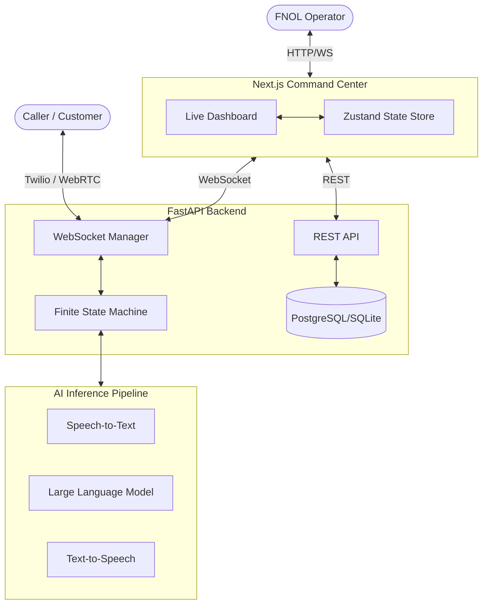

# System Architecture & Design

Vaani is built with a decoupled architecture, separating the real-time AI inference pipeline from the tactical observation frontend. 

## High-Level Architecture Diagram

## Core Components

### 1. The Finite State Machine (FSM)
The core logic of the Vaani agent is not a single sprawling LLM prompt, but rather a deterministic Finite State Machine. This ensures the AI follows strict insurance compliance protocols and doesn't hallucinate outside of its current objective.

**States:**
1. `GREETING`: Identify the caller and purpose.
2. `POLICY_VERIFY`: Collect policy number and validate.
3. `INCIDENT_CAPTURE`: Determine if it's auto, home, or medical.
4. `DETAILS_CAPTURE`: Gather specific details (injuries, location, damage).
5. `CONTACT_VERIFY`: Confirm callback number.
6. `SUMMARY`: Summarize and conclude the call.

### 2. The AI Pipeline (Backend)
The backend pipeline operates asynchronously to minimize latency. 
- **STT (Speech-to-Text)**: Streams audio from the caller and converts to text (e.g., via Deepgram).
- **LLM (Reasoning)**: The LLM acts as the "brain". It takes the STT output, the current FSM state instructions, and the conversation history to generate a response AND extract structured JSON data (FNOL record).
- **TTS (Text-to-Speech)**: Streams the LLM text output back to the caller as human-like audio (e.g., via ElevenLabs).

### 3. Real-Time Observability (Frontend)
The Next.js frontend uses a Zustand store to manage real-time state. It connects to the FastAPI backend via WebSockets.
- Every time the Pipeline processes a turn (User speaks -> Agent replies), the backend broadcasts a JSON payload.
- The Zustand store updates the `liveCalls` dictionary.
- The React components (like `LiveCallPanel` and `CallCard`) re-render instantly, allowing operators to monitor the FSM state, extracted variables, and transcription latency in real-time.
